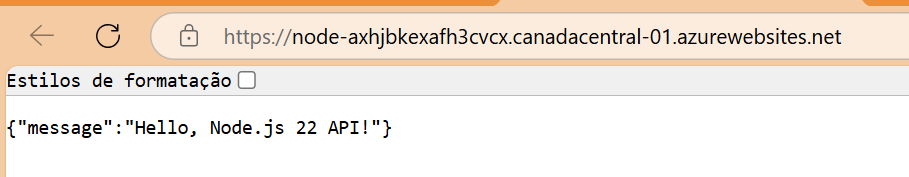

# app-nodejs

Repo app nodejs

## Requisitos

- Node.js 22+

## Scripts

- `npm run dev` — roda a API em modo desenvolvimento
- `npm run build` — gera o pacote em `/dist`
- `npm start` — executa a API a partir de `/dist`

## Estrutura

- `src/` — código-fonte
- `dist/` — build final

## API

- `GET /` — retorna `{ "message": "Hello, Node.js 22 API!" }`
- `GET /hello/:name` — retorna `{ "message": "Hello, <name>!" }`
- `GET /ping` — retorna `{ "pong": true }`
- `POST /sum` — recebe `{ a, b }` e retorna `{ result: a + b }`
- `GET /math/multiply?a=2&b=3` — retorna `{ result: 6 }`
- `POST /math/divide` — recebe `{ a, b }` e retorna `{ result: a / b }` (erro se `b == 0`)
- `GET /time` — retorna `{ now: "<ISO date string>" }`

